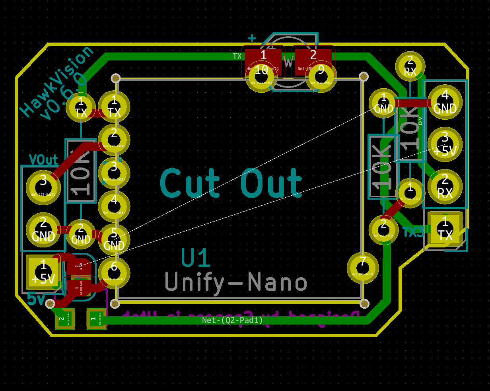

# HawkVision

Adapter board that makes it easy to mount a TBS unify nano to the Hawk 5

Based off the same idea as [whitenoise FPV](https://whitenoisefpv.com/collections/electronics/products/unify-nano-mounting-board) but designed specifically for the emax stack
